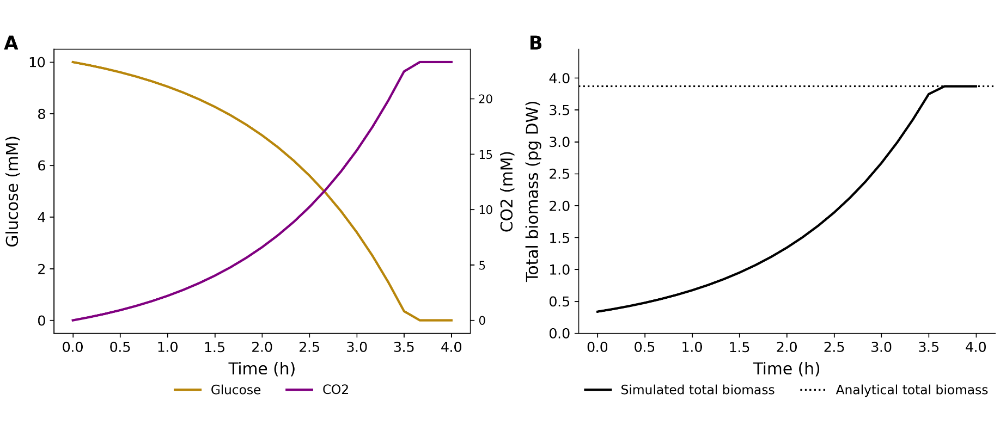

# Mass-conservation test

<div class="key-path">
  <strong>Directory:</strong> <code>sample_projects_intracellular/fba/dfba_unit_test/</code><br>
  <strong>Make target:</strong> <code>dfba_unit_test</code><br>
  <strong>Executable:</strong> <code>dfba-unit-test</code>
</div>

## Purpose

This controlled closed-batch model checks the numerical bridge between extracellular concentration, FBA uptake, dry weight, biomass objective, and PhysiCell volume. Because the initial glucose mass is known, the maximum biomass can be calculated independently.

## Run

```bash
make dfba_unit_test
make
./dfba-unit-test config/unit_test_mass_conversion_lit_params.xml
```

The C++ executable accepts an XML path as its first argument. Without one, it reads `config/PhysiCell_settings.xml`.

## Important files

| File | Role |
| --- | --- |
| `config/unit_test_mass_conversion_lit_params.xml` | Manuscript validation setup |
| `config/Ecoli_core.xml` | Core model including growth-associated maintenance |
| `config/Ecoli_core_noGAM.xml` | Variant used to isolate maintenance effects |
| `scripts/dfba_analysis.ipynb` | Output analysis |
| `scripts/plot_df_journal_style_ext.py` | Reusable plotting helper |

The validation XML uses a 10 mM glucose pool in a closed 16 × 16 × 16 µm domain and one cell. Both `dt_diffusion` and `intracellular_dt` are 0.01 min.

## Reported result

Glucose decreases monotonically and is exhausted after roughly 3.5 h. Biomass increases until depletion, while part of the supplied carbon appears as CO₂.

| Energy-maintenance setting | Analytical biomass | Simulated biomass |
| --- | ---: | ---: |
| Without non-growth-associated ATP maintenance | 4.08 pgDW | 4.09 pgDW |
| With non-growth-associated ATP maintenance | 3.87 pgDW | 3.88 pgDW |

The relative error is below 1% in both cases. The analytical yield is derived from an independent solve of the same model and constraints, rather than a fixed literature yield.

<figure markdown="span">
  
  <figcaption>Mass-conservation test. (A) Glucose consumption and CO₂ production. (B) Simulated total biomass converges to the analytical biomass prediction.</figcaption>
</figure>

## What to change

Use this project to test:

- a new SBML model or biomass reaction;
- different initial substrate masses;
- ATP-maintenance constraints;
- dry-mass density and cell-volume assumptions;
- voxel size or timestep sensitivity.

Change one element at a time and recompute the analytical yield under exactly the same metabolic constraints.
