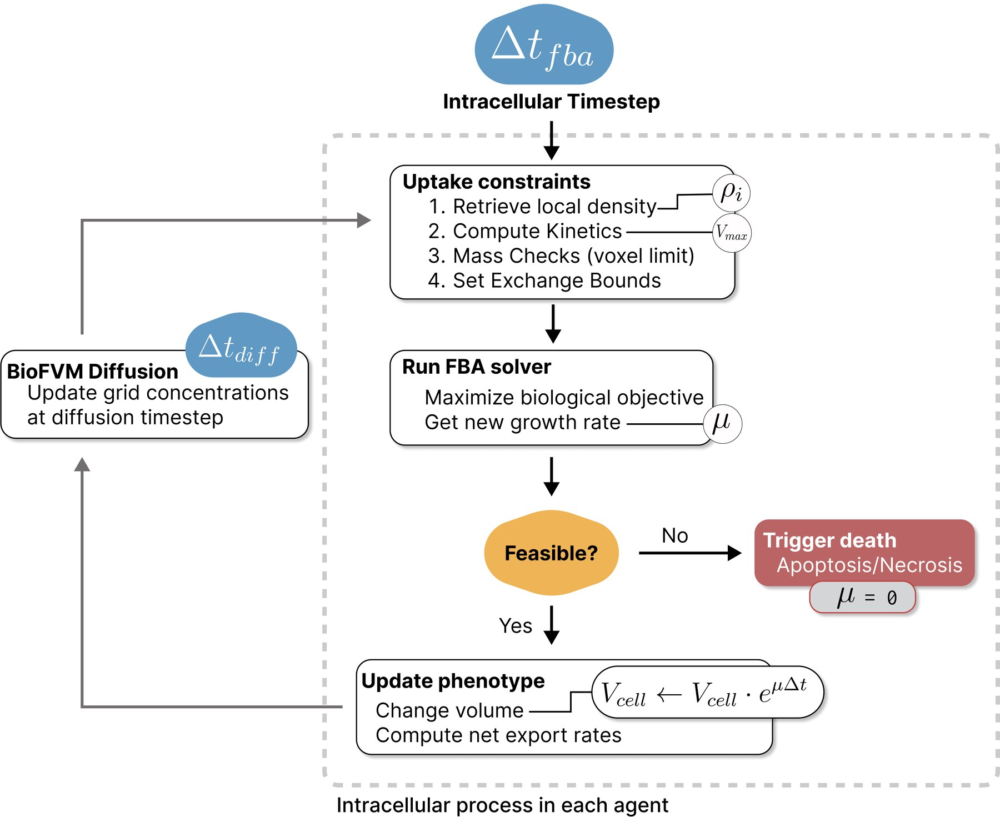

# PhysiCelldFBA

PhysiCelldFBA extends [PhysiCell](https://physicell.org/) with dynamic flux balance analysis (dFBA). Each metabolic cell carries its own SBML-encoded constraint-based model, senses the substrates available at its position, solves a locally constrained FBA problem, and feeds the resulting growth and exchange fluxes back to the cell phenotype and BioFVM microenvironment.

This coupling makes it possible to study how intracellular metabolism, extracellular transport, cell mechanics, and population organization influence one another in space and time.

<figure markdown="span">
  
  <figcaption>PhysiCelldFBA update workflow for each metabolic cell.</figcaption>
</figure>

## What you can model

- A separate metabolic state and flux distribution for every agent.
- Uptake and secretion controlled by the local BioFVM microenvironment.
- Biomass-driven cell growth with explicit unit conversion and local mass limits.
- Multiple organisms or cell types carrying different metabolic models.
- Metabolism-dependent death and custom objectives that influence behaviors such as motility.
- Genome-scale as well as reduced metabolic reconstructions.

## Start here

| Goal | Documentation |
| --- | --- |
| Install dependencies and compile a dFBA project | [Installation](getting-started/installation.md) |
| Run the smallest validation example | [First simulation](getting-started/first-simulation.md) |
| Understand the coupling algorithm | [dFBA update cycle](concepts/update-cycle.md) |
| Connect an SBML model to PhysiCell | [PhysiCell XML configuration](configuration/physicell-xml.md) |
| Look up a dFBA parameter | [Parameter reference](configuration/parameters.md) |
| Explore the supplied models | [Examples](examples/index.md) |
| Configure dFBA graphically | [PhysiCell Studio](physicell-studio.md) |

!!! important "Cite PhysiCelldFBA, PhysiCell, and BioFVM"

    When using PhysiCelldFBA, please cite PhysiCell, BioFVM, and PhysiCelldFBA. See [Citation](reference/citation.md).

## Scope

These pages document the PhysiCelldFBA extension: its installation, coupling algorithm, configuration, source layout, and supplied dFBA examples. For general PhysiCell concepts such as cell mechanics, cycle models, BioFVM configuration, output formats, or custom modules, use the [PhysiCell resources](reference/resources.md).
