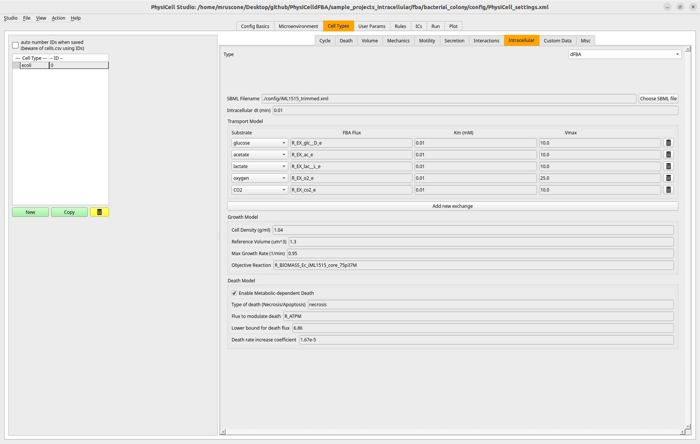

# PhysiCell Studio

[PhysiCell Studio](https://github.com/PhysiCell-Tools/PhysiCell-Studio) is a graphical interface for creating, editing, running, and visualizing PhysiCell models. It supports the PhysiCelldFBA XML block through the intracellular-model controls, allowing users to configure dFBA without writing the complete XML by hand.

## Install Studio

Clone the Studio repository and follow its current installation instructions:

```bash
git clone https://github.com/PhysiCell-Tools/PhysiCell-Studio.git
```

PhysiCell distributions also include helper scripts for obtaining Studio. Prefer the Studio version known to support the dFBA tab used by your PhysiCelldFBA checkout.

## Configure a dFBA cell

In the cell-type intracellular controls:

1. select **dFBA** as the intracellular model;
2. choose or enter the SBML file;
3. set the intracellular timestep equal to the PhysiCell diffusion timestep;
4. add one transport row per extracellular substrate;
5. map each row to its SBML exchange reaction;
6. set `Km` and `Vmax`;
7. set density, reference volume, growth cap, and objective reaction;
8. optionally configure metabolism-dependent death.

The substrate field should be selected from the microenvironment variables already defined in Studio. This reduces spelling mismatches between BioFVM fields and the dFBA block.

<figure markdown="span">
  
  <figcaption>The PhysiCell Studio dFBA tab exposes the PhysiCelldFBA configuration fields through its graphical interface.</figcaption>
</figure>

## XML generated by Studio

Saving the model writes an `<intracellular type="dfba">` block into the selected cell definition. After saving, inspect the XML once and verify:

- `sbml_filename` is inside `settings` and is portable;
- `intracellular_dt = dt_diffusion`;
- substrate names and reaction IDs are correct;
- growth units follow the metabolic-model convention;
- any optional death trigger exists in the SBML model.

Studio can validate the XML structure and offer known substrate names, but it cannot determine whether a reaction is biologically appropriate or whether its units and bounds match the intended experiment.

## Open and run a supplied example

1. Select a supported sample project in PhysiCelldFBA.
2. Open its `config/PhysiCell_settings*.xml` in Studio.
3. Inspect the microenvironment and the dFBA cell definition.
4. Save to a new XML filename while learning; do not overwrite the reference configuration.
5. Compile the matching C++ sample project.
6. Run the saved configuration and use Studio to inspect standard PhysiCell outputs.

Project-specific analysis of intracellular fluxes can still require the scripts supplied with the example.

## Cite Studio when used

If Studio contributed to building, exploring, or visualizing a published model, cite the Studio method paper in addition to PhysiCelldFBA, PhysiCell, and BioFVM. See [Citation](reference/citation.md).
